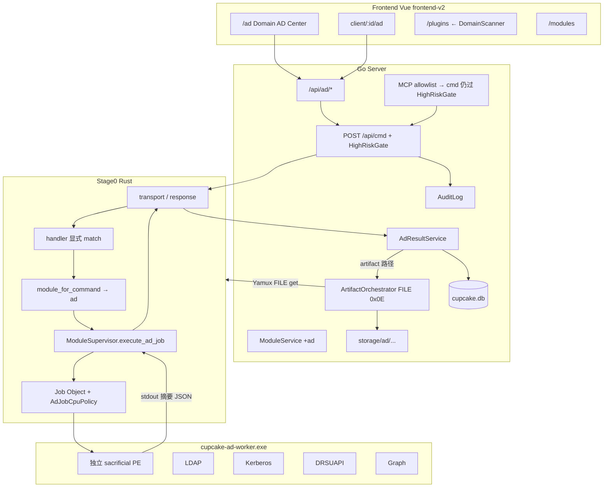
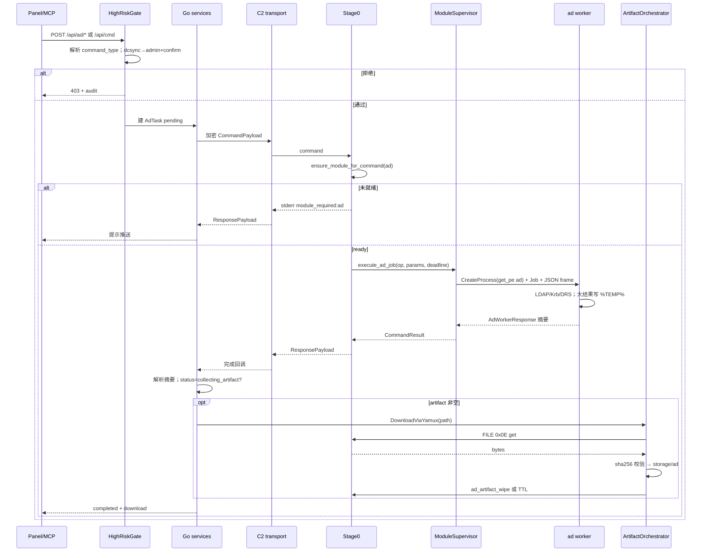
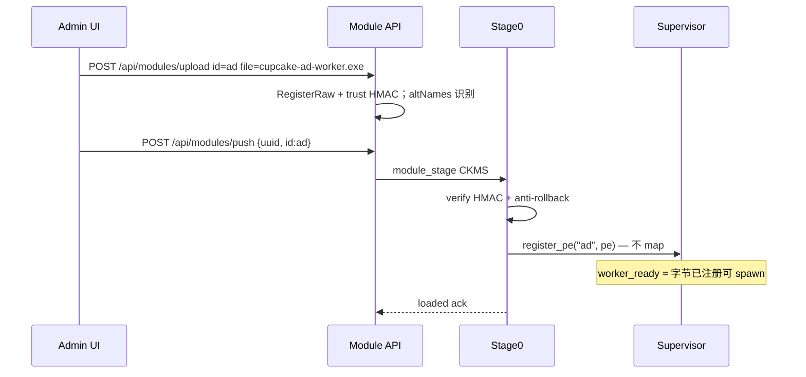
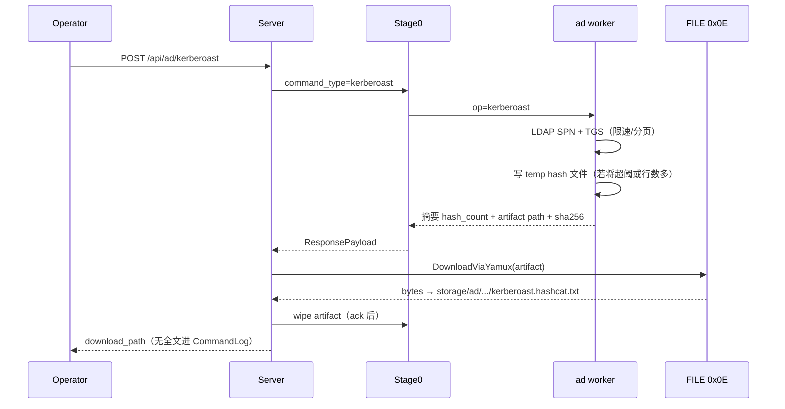
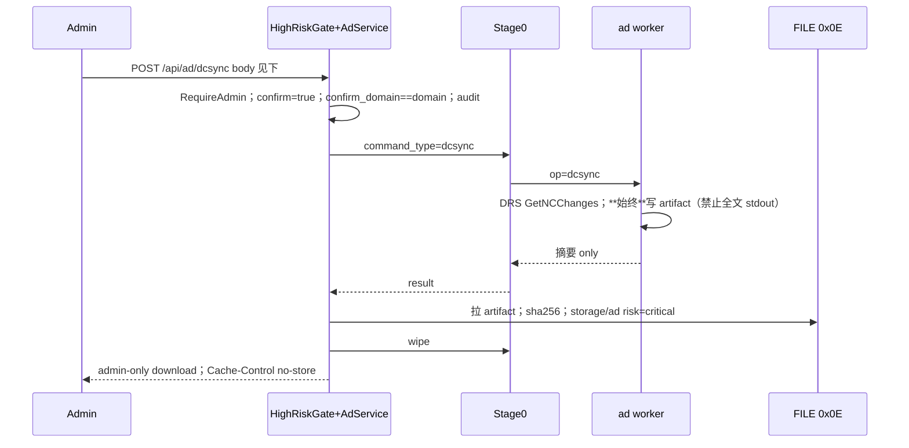
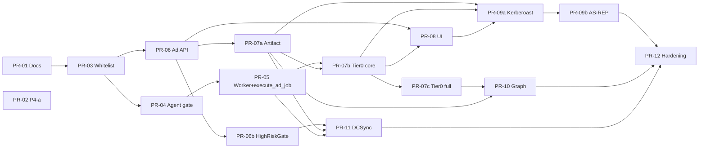

# Cupcake C2 — L2 `ad` 域渗透 / 域控后利用套件设计文档

| 字段 | 值 |
|------|-----|
| **文档标题** | Active Directory / Domain Controller Post-Exploitation Suite (L2 `ad`) |
| **产品** | Cupcake C2 ≈ 4.2.0 |
| **作者** | Architecture / Post-Ex |
| **日期** | 2026-08-06 |
| **修订** | 2026-08-06 r6（P4-b.0–b.4 产品路径落地：Tier0/roast 格式/artifact/graph/dcsync feature-off + AD UI） |
| **状态** | Implemented (offline/format/DoD); live-domain ticket density remains lab-enhanced |
| **关联** | `docs/POSTEX_WORKLIST.md` §4.8 / §6.P4 / §9；`docs/MODULE_WORKER_ISOLATION.md`；`docs/SECURITY_HARDENING.md`；`docs/REMOTE_DESKTOP_RETIRED.md` |
| **工作区** | `E:\临时渗透\渗透开发\C2-dev-main` |
| **参考代码（只读）** | `E:\临时渗透\渗透开发\khaos-c2-main\khaos-c2-main`（[28Zaaky/khaos-c2](https://github.com/28Zaaky/khaos-c2)，MIT） |

---

## Overview

Cupcake 产品 L2 白名单为 `iso_host` | `inject` | **`ad`**（见 `server/services/module_service.go` 的 `productModuleIDs`）。**P4-b.0–b.4 产品路径已落地**（r6）：`module_required:ad`、sacrificial `cupcake-ad-worker`（`ping` + Tier0 稳定码/枚举壳 + hashcat 格式与 artifact 策略 + graph.zip + 默认 `dcsync=feature_disabled`）、`/api/ad/*` 高危门禁、`storage/ad` 摘要脱敏、面板 `/ad` 与 `client/:id/ad`。**活域** LSA 票证密度 / 深 LDAP 页 / 完整 DRSUAPI 仍可 lab 增强。话术：可写「L2 ad：域枚举 + Kerberoast/AS-REP 格式与管道」；**禁止**写发行二进制默认含 DCSync、完整 Mimikatz，或「ad 一切已完成」。P4-a 插件路径仍保留为 lab 过渡。

本文给出 **完整 AD 后利用产品** 的端到端设计：Agent（Rust Stage0 + 独立 sacrificial worker PE）、Server（Go API / 高危命令门禁 / 存储 / RBAC / 审计 / artifact 编排）、Frontend（Vue frontend-v2 新 AD 面）。目标是在不撑大 Stage0、不破坏 fail-closed 信任与 Worker 隔离的前提下，交付可验收的域态势感知、凭据材料采集、高权限复制类攻击与图/ACL 采集能力。

**一句话方案：** 引入单一产品模块 **L2:`ad`**（**iso_host 同类**的独立 sacrificial worker PE，经 ModuleSupervisor 注册字节、CreateProcess + Job Object 执行；**不是** inject 的「能力注册 + 由 iso_host KIND 执行」模型）；命令面用稳定 `command_type`（如 `ad_discover`、`ad_enum_users`、`kerberoast`、`dcsync`）；**所有入口**（含 `POST /api/cmd` 与 MCP）对高危类型做服务端门禁；大结果走 **server 发起的 Yamux FILE 0x0E 拉取** 至 `storage/ad/`；面板新增 `/ad` 与客户端 AD 子页；P4-a 插件路径保留为 lab 与过渡。

---

## Background & Motivation

### 当前状态

| 区域 | 现状 | 证据路径 |
|------|------|----------|
| 产品 L2 白名单 | **`iso_host` \| `inject` \| `ad`** | `server/services/module_service.go` `productModuleIDs` |
| Worker 隔离 | Stage0 永不 LoadLibrary 产品 L2；Supervisor + Job Object | `docs/MODULE_WORKER_ISOLATION.md`，`Client/core/src/module_supervisor/` |
| inject 执行路径 | **非**独立 inject PE 长驻；`register_pe("inject")` + `execute_inject_json` → **iso_host** 子进程 + **binary** job frame（`JOB_MAGIC`，KIND_INJECT=3） | `module_loader.rs` invoke inject；`module_supervisor/mod.rs`；`iso_host/src/main.rs` |
| **ad 执行路径** | 独立 sacrificial PE + **u32le JSON** 帧（KD-17）；`execute_ad_job` | `modules/ad/`，`module_supervisor/ad_exec.rs` |
| IPC 类型 | `WorkerRequest` JSON 定义在 `ipc.rs`；**inject 线上不用该 JSON**，用 binary frame；**ad 用 JSON 帧** | `module_supervisor/ipc.rs` vs inject/ad 路径 |
| Job Object | kill-on-close；active processes 32；job memory 512 MiB；**per-process user-mode CPU 60s**（inject/iso；ad 墙钟 per-op，CPU 策略可增强） | `module_supervisor/job_object.rs` |
| 命令门禁 | `module_for_command`：AD → `ad`；shell/file/process→None；bof/dotnet→`iso_host`；inject→`inject` | `Client/core/src/module_loader.rs` |
| 高危门禁 | **`dcsync`**：admin 别名 + confirm/confirm_domain；MCP 硬拒绝；挂在 `SendAdCommand` | `server/services/command_policy.go` |
| 通用命令 | `POST /api/cmd` 仍为 shell 便利层；**AD 走 `/api/ad/*`** | `ad_controller.go`，`client_controller.go` |
| MCP 写路径 | 只读关时唯一写：`POST /api/cmd`（AD POST 不在 MCP allowlist） | `server/pkg/middleware/auth.go` `mcpAllowlist` |
| 文件回传 | Yamux **FILE 0x0E** + AD **`storage/ad/{agent}/{task}/`** 摘要/artifact | `file_service.go`，`ad_artifact.go` |
| 插件 UI | 全局 **`/plugins`**（`/domain` 永久重定向）；侧栏「插件」；`client/:id/plugins` | `router/index.js`，`MainLayout.vue` |
| **AD UI** | 全局 **`/ad`** + **`client/:id/ad`** | `AdCenter.vue`，`AdPanel.vue` |
| 任务结果 | `AdTask` + 脱敏摘要；CommandLog 对 AD 走 `SanitizeSummaryForLog`；artifact download | `ad_service.go`，`command_store.go` |
| Desktop | **已退役**（v4.2.0） | `docs/REMOTE_DESKTOP_RETIRED.md` |
| 域攻击 | **P4-b 产品路径已合入**；活域票证/DRS 可增强 | `docs/POSTEX_WORKLIST.md` §6.P4 |

### 痛点

1. **无一等 AD 命令**：操作员只能靠插件 + 裸 stdout，无参数表单、无 hash 导出、无图数据归档。
2. **路由语义错误**：`/domain` 名称为 Domain，实为 Plugin Manager。
3. **引擎与载荷混淆风险**：Seatbelt/Rubeus 类载荷应是 Plugin；协议引擎应是 L2 `ad`。
4. **安全与 OPSEC**：明文密码不得进 agent 日志；DCSync 等高危若仅靠 `/api/ad` 封装，**可被 `/api/cmd` / MCP 绕过**。
5. **输出上限**：worker stdout/stderr 各 **2 MiB**；多 SPN roast / DCSync / 图均可超限。
6. **体积与隔离**：域协议栈不得进 Stage0。
7. **Job CPU**：60s 用户态 CPU 与 180–300s 墙钟 deadline 冲突，需明确策略。

---

## Goals & Non-Goals

### Goals

1. 交付 **L2:`ad`** 产品模块：白名单、推送、HMAC 信任、`module_required:ad`、**独立 sacrificial PE** worker 隔离。
2. 覆盖 **能力矩阵**（见下）：Tier 0 态势 → Tier 1 无高权 roast → Tier 2 特权复制 → Tier 3 图/ACL → Tier 4 / backlog 边界清晰。
3. **全栈**：Agent 命令、Server API/存储/导出、**全入口高危门禁**、Frontend 表单与结果浏览。
4. 与现有三层模型一致：**Stage0 薄**、**L2 引擎**、**Plugin 载荷**。
5. 保留 **P4-a 插件过渡**；P4-b 分阶段 DoD；原生实现可回退编排插件但 **不得** 提前宣称 L2 完成。
6. 结果：hashcat/john 文本、结构化 JSON、图 ZIP；**大结果统一 artifact 管道**。
7. 安全：RBAC、审计、高危二次确认、密钥材料脱敏、fail-closed 模块信任。

### Non-Goals（确认）

| 非目标 | 说明 |
|--------|------|
| 内嵌完整 Mimikatz 交互 shell | 不做；LSASS 归 `cred` |
| C2 服务端离线 hash 爆破 | 只导出 hash 文件 |
| 横向移动 / `wmi_exec` | 归 L2:`lateral`；`ad` **拒绝** 此类 operation |
| Token 窃取/冒充 | 归 L2:`token` |
| 替换 BloodHound GUI | 仅采集与导出 |
| MVP 破坏性 AD 写操作 | 不默认支持；若未来做须高危 opt-in + admin + 审计 + 全入口门禁 |
| 复活 Desktop | 已退役 |
| 将 Kerberoast 做进 Stage0 | 禁止 |
| MVP Password spray | 高噪声（Tier4 / non-goal） |
| MVP 在 agent 内 Golden/Silver 组票 | 离线 / Server Tool |

---

## Key Decisions

| # | 决策 | 选择 | 理由 |
|---|------|------|------|
| **KD-1** | 模块粒度 | **单一 L2 `ad`**（内部 `AdJob.op`） | 共享 LDAP/SSPI/Kerberos；一次推送；超 ~6–7 MiB 再评拆 `ad_graph` |
| **KD-2** | 实现形态 | **产品路径：原生 Rust worker**；P4-a 插件过渡；DCSync 用 Windows RPC/FFI；设 **spike 门槛与体积预算**（见 Implementation Feasibility） | 避免长期 CLR 绑定；原生滑期可用插件编排但话术降级 |
| **KD-3** | 与其它 L2 | **正交**；`ad` 不实现 token/lsass/wmi | POSTEX 决策树 |
| **KD-4** | 结果存储 | **DB 元数据 + `storage/ad/{agent}/{task}/`**；大载荷 **永不** 塞满 CommandLog | 2 MiB 上限 + 脱敏 |
| **KD-5** | 前端路由 | **新建 `/ad` + `client/:id/ad`**；全局插件迁 **`/plugins`**；**`/domain` → `/plugins` 永久重定向** | 修正误名且兼容书签 |
| **KD-6** | 交付节奏 | **P4-a → P4-b.0…b.4**；B0–B2 才可对外「L2 ad roast」 | 与 POSTEX 话术一致 |
| **KD-7** | Worker 模型 | **`ad` = 独立 sacrificial worker PE（iso_host-class 进程隔离）**：Stage0 仅 `register_pe` + `CreateProcess` + Job Object + **文档化帧格式**；**不是** inject 的「注册能力、由 iso_host KIND 执行」；**不是** 假定现有 `WorkerRequest` JSON 已在 inject 路径使用 | 与代码现状对齐；新增 `execute_ad_job` / `spawn_product_worker` API |
| **KD-8** | 高危命令 | **`dcsync` / 未来 `ad_write_*`：无论入口（`/api/ad/*`、`POST /api/cmd`、MCP）均 admin + 确认字段**（字段见 **KD-20**）；MCP 对高危类型 **硬拒绝**；**发行默认无 DCSync 二进制**（**KD-18**） | 消除 operator/MCP 绕过（Issue 1） |
| **KD-9** | Golden/Silver | **离线**；agent 不做组票 MVP | 复杂度与日志风险 |
| **KD-10** | Password spray | **MVP Non-goal** | OPSEC / 锁账户 |
| **KD-11** | Token 继承 | **MVP：`ad` worker 仅继承 Stage0 进程 primary token**（CreateProcess 默认）；**不**传递 impersonation/duplicated handle。线程模拟身份 **不会** 自动到子进程。操作约束：域用户上下文需 **agent 进程本身** 以该身份运行。P2+：可选「以网络凭据/令牌 spawn worker」（依赖 `token` 模块设计） | 与 sacrificial PE 模型一致（Issue 8） |
| **KD-12** | 平台 | **`ad` Windows-only**；非 Windows：`unsupported_platform`，**不** stage PE | inject/iso_host 亦 Windows 向；避免 Linux stub 假实现 |
| **KD-13** | Job CPU vs 墙钟 | **双轨**：(1) 默认分页，使单 job 用户态 CPU **&lt; 50s**（留余量给 60s 硬限）；(2) Supervisor 为 `ad` 提供 **可配置 per-module CPU 策略**（`AdJobCpuPolicy`：`inherit` \| `extended_300s` \| `unlimited_cpu`），lab/prod 默认 `extended_300s` 仅对 `ad`，inject/iso_host 仍 60s。验收：墙钟长、CPU 低的 LDAP wait **不得** 被 60s 误杀 | `job_object.rs` 现状（Issue 3） |
| **KD-14** | Artifact | **Server 拥有拉取与 wipe 时序**；agent 在 ack 前不得删敏感 temp；stdout 仅摘要 | FILE 0x0E 语义（Issue 2） |
| **KD-15** | 图导出格式 MVP | **Cupcake Graph JSON ZIP**（nodes/edges）+ **面板 ECharts 预览**；**不做** BloodHound 兼容导出 | 产品内预览即可 |
| **KD-16** | 信任域 | **MVP：当前域完整枚举 + 信任关系列表（只读）**；跨信任深度枚举 / 跨域 roast = backlog | 关闭 OQ#3 的 MVP 答案 |
| **KD-17** | 帧格式 | **AD worker 线格式：长度前缀 JSON**（`u32le` length + UTF-8 JSON `AdWorkerRequest`/`AdWorkerResponse`），与 inject binary KIND 帧 **分离**；实现落在新 supervisor API，不复用 inject 二进制路径 | 实现清晰；避免 KIND 神对象 |
| **KD-18** | DCSync 发行剥离 | **发行/分发构建默认排除 DCSync 与 DRSUAPI 路径**（Cargo feature，如 `ad-dcsync`，**默认 off**）。Lab/内部构建显式 `--features ad-dcsync` 启用。Server 侧：无该能力的 worker 返回明确错误；`CUPCAKE_AD_DCSYNC_ENABLED` 仍可关 API。 | 用户决策 2026-08-06；降低发行面合规/误用风险 |
| **KD-19** | storage/ad 静态加密 | **MVP 不做应用层 at-rest 加密**。依赖 OS 目录 ACL + critical admin-only 下载 + 短保留（默认 3 天）。未来可选增强，不阻塞实现。 | 用户决策 2026-08-06 |
| **KD-20** | confirm_nonce | **MVP 仅** `confirm: true` + `confirm_domain` 与 `domain` 大小写不敏感相等 + admin 角色。**不要求** 双步 nonce。`confirm_nonce` / prepare 端点为未来可选增强。 | 用户决策 2026-08-06 |

---

## Capability Matrix（强制）

### Tier 0 — 域态势感知

| 能力 | command_type | Priv | Module | 输入（JSON 要点） | 输出 | OPSEC | 服务端 | UI |
|------|--------------|------|--------|-------------------|------|-------|--------|-----|
| DC / 域发现 | `ad_discover` | 域用户 | `ad` | `domain?`, `dns_server?` | JSON：DCs、站点、功能级别 | LDAP/DNS SRV | `ad_tasks` + 摘要 | 表单 + 拓扑卡片 |
| LDAP 查询 | `ad_ldap_query` | 域用户 | `ad` | `base`, `filter`, `attrs[]`, `scope`, `size_limit`, `page_token?` | JSON / artifact NDJSON | LDAP；强制 size/page | 超阈走 artifact | 查询构建器 |
| 用户枚举 | `ad_enum_users` | 域用户 | `ad` | `filter?`, `include_disabled?`, `page_token?` | JSON/artifact | LDAP | 同上 | 表格 |
| 组枚举 | `ad_enum_groups` | 域用户 | `ad` | `group?`, `nested?` | JSON | LDAP | 同上 | 表格 |
| **特权组快照** | `ad_enum_privileged_groups` | 域用户 | `ad` | 固定关注 Domain/Enterprise/Schema Admins、Account Operators、Administrators 等 | JSON 成员 | LDAP | 元数据 | 高亮卡片（MVP **建议做**，可挂 B1 末或 B1.1） |
| 计算机枚举 | `ad_enum_computers` | 域用户 | `ad` | `os_filter?`, `enabled_only?` | JSON | LDAP | 同上 | 表格 |
| SPN 枚举 | `ad_enum_spns` | 域用户 | `ad` | `account_type?` | JSON | LDAP | 同上 | 可跳转 roast |
| 信任关系 | `ad_enum_trusts` | 域用户 | `ad` | `domain?` | JSON（当前域信任列表） | LDAP | 同上 | 信任简表 |
| 密码策略 | `ad_password_policy` | 域用户 | `ad` | `domain?` | JSON | LDAP | 同上 | 策略面板 |
| 委派发现 | `ad_enum_delegation` | 域用户 | `ad` | `kinds: unconstrained\|constrained\|rbcd` | JSON | LDAP | 同上 | 高亮 unconstrained |
| GPO 线索 | `ad_enum_gpo` | 域用户 | `ad` | `link_scope?` | JSON | LDAP | 同上 | 列表 |
| 会话/本地管理员（尽力） | `ad_collect_sessions` | 需可读会话源 | `ad` | `targets[]?`, `method` | JSON | **高噪声**；默认关 | 文件 | 高级选项 + 警告 |
| LDAP 安全模式 | （参数，非独立命令） | — | `ad` | `ldap_sign: auto\|required\|off`, `use_ldaps` | 错误码见下 | channel binding / signing 失败可诊断 | — | 高级选项 |

**共享参数：**

```json
{
  "domain": "corp.local",
  "dc": "dc01.corp.local",
  "ldap_port": 389,
  "use_ldaps": false,
  "ldap_sign": "auto",
  "timeout_ms": 60000,
  "page_size": 500,
  "page_token": null,
  "output": "json"
}
```

### Tier 1 — 低权限凭据材料

| 能力 | command_type | Priv | Module | 输入 | 输出 | OPSEC | 服务端 | UI |
|------|--------------|------|--------|------|------|-------|--------|-----|
| Kerberoast | `kerberoast` | 域用户 | `ad` / P4-a Plugin | 见下 **params** | hash 行 → **优先 / 超阈 artifact** | TGS 批量；**请求间 jitter** | `*.hashcat.txt`；CommandLog **仅摘要** | 表单 + 导出 + 复制 |
| AS-REP Roast | `asrep_roast` | 域用户 | 同上 | 见下 **params** | 同上 | AS-REQ→DC:88 | 同上 | 表单 + 导出 + 复制 |

**规范来源：** 默认算法路径、LDAP 过滤器、hashcat 行格式以 **[Prior Art: Khaos C2](#prior-art-khaos-c2-域能力对照与可借鉴规格)** 为 B2 基线；Cupcake 必须叠加分页、artifact、worker 隔离与 jitter 可配置。

#### `kerberoast` params（JSON 草图）

```json
{
  "spns": null,
  "users": null,
  "format": "hashcat",
  "etype": "rc4",
  "jitter_ms_min": 40,
  "jitter_ms_max": 120,
  "exclude_disabled": true,
  "exclude_krbtgt": true,
  "page_size": 500
}
```

| 字段 | 说明 |
|------|------|
| `spns` / `users` | 可选；均空则 LDAP 自动发现（Khaos 默认行为） |
| `format` | MVP 必支持 `hashcat`；`john` 可选二期 |
| `etype` | `rc4`（默认，Kerb etype 23）\| `aes`（AES256 etype 18）；对应 Khaos `args` 含 `aes` |
| `jitter_ms_*` | 每次成功/尝试 TGS 后 Sleep 随机区间；默认 40–120（对齐 Khaos OPSEC） |

**默认 LDAP 过滤器（自动发现，对齐 Khaos）：**

```text
(&(objectCategory=user)(servicePrincipalName=*)
  (!samAccountName=krbtgt)
  (!userAccountControl:1.2.840.113556.1.4.803:=2))
```

属性：`sAMAccountName`, `servicePrincipalName`。  
Realm：`GetComputerNameEx(ComputerNameDnsDomain)` 转大写。  
票证：`LsaConnectUntrusted` → `LsaLookupAuthenticationPackage("Kerberos")` → `LsaCallAuthenticationPackage(KerbRetrieveEncodedTicketMessage)`，`KERB_RETRIEVE_TICKET_DONT_USE_CACHE`；从 Ticket DER 取 enc-part cipher。

**hashcat 输出行（验收金标准）：**

```text
$krb5tgs$<etype>$*<sam>$<REALM>$<spn>*$<cipher_hex_first_16_bytes>$<cipher_hex_rest>
```

例（结构，非真实票）：`$krb5tgs$23$*svc_sql$CORP.LOCAL$MSSQLSvc/db.corp.local:1433*$aabb...$ccdd...`

#### `asrep_roast` params（JSON 草图）

```json
{
  "users": null,
  "format": "hashcat",
  "jitter_ms_min": 40,
  "jitter_ms_max": 120,
  "exclude_disabled": true
}
```

**默认 LDAP 过滤器（对齐 Khaos；UAC bit `0x400000` = DONT_REQUIRE_PREAUTH）：**

```text
(&(objectCategory=user)
  (userAccountControl:1.2.840.113556.1.4.803:=4194304)
  (!userAccountControl:1.2.840.113556.1.4.803:=2))
```

DC 发现：`DsGetDcNameW(NULL,…, DS_DIRECTORY_SERVICE_REQUIRED)`，去掉 `\\` 前缀。  
协议：对每个用户向 DC **TCP 88** 发最小 AS-REQ（无预认证），解析 AS-REP enc-part cipher。

**hashcat 输出行（验收金标准）：**

```text
$krb5asrep$23$<sam>@<REALM>$<cipher_hex_first_16_bytes>$<cipher_hex_rest>
```

#### Tier 1 强制策略（与 Khaos 差异 — Cupcake 必须做）

| 项 | Khaos | Cupcake |
|----|-------|---------|
| 代码位置 | 常驻 agent `kerberos.c` | **仅** L2 `ad` worker；Stage0 无 LDAP/LSA 烤票 |
| 大结果 | stdout 缓冲 | 结果字节 **&gt; 256 KiB 或 dcsync 同类敏感** → **强制 artifact**（§7）；摘要含 `hash_count`、`sha256` |
| LDAP | 无分页 `ldap_search_s` | 大域 **分页 / page_token**（KD-13） |
| 日志 | 终端输出即 hash | CommandLog / 任务日志 **禁止完整 hash 行**；仅计数与路径 |

### Tier 2 — 特权域攻击

| 能力 | command_type | Priv | Module | 输入 | 输出 | OPSEC | 服务端 | UI |
|------|--------------|------|--------|------|------|-------|--------|-----|
| DCSync | `dcsync` | 复制权 / DA 等同 | `ad`（**需 feature `ad-dcsync`**，发行默认无） | 见 Confirm 契约 | hash → **强制 artifact** | DRSUAPI | 文件 + **强制审计**；admin-only 列表/下载 | admin 确认模态；发行包无此 op 时 UI/API 不可用或返回 `feature_disabled` |
| 复制权限探测 | `ad_check_replication_rights` | 域用户 | `ad` | `principal?` | JSON ACE | LDAP ACL 读 | 元数据 | 只读 |

### Tier 3 — 图 / ACL

| 能力 | command_type | Priv | Module | 输入 | 输出 | OPSEC | 服务端 | UI |
|------|--------------|------|--------|------|------|-------|--------|-----|
| 图采集 | `ad_graph_collect` | 域用户 | `ad` | `methods[]`: `object_props,acl,sessions?,local_admins?`, `collection` | **graph.zip artifact** | 大量 LDAP | artifact | **预览图** + 下载产物 |
| ACL 聚焦 | `ad_acl_collect` | 域用户 | `ad` | `targets[]` | JSON/artifact | nTSecurityDescriptor | 文件 | ACL 表 |

**MVP 图格式（KD-15）：** Cupcake Graph JSON（单文件 `graph.json` 打进 zip）：

```text
graph.zip
  graph.json   # { format: cupcake-graph-v1, domain, nodes[], edges[], meta }
```

**面板 API：**

| Method | Path | 说明 |
|--------|------|------|
| GET | `/api/ad/tasks/:id/graph` | 解析 artifact → 力导向预览 DTO（ECharts） |

不做 BloodHound / OpenGraph 导出。

### Tier 4 — Stretch

| 能力 | 归属 | MVP | 说明 |
|------|------|-----|------|
| Golden / Silver 生成 | 离线 / Tool | 否 | 从 DCSync 材料本机做 |
| PTT / 票证注入 | `token` 协作 | 否 | |
| Password spray | Non-goal | 否 | |
| ADCS 只读枚举 | stretch `ad_enum_adcs` | 否 | |
| 域写操作 | 非 MVP | 否 | `CUPCAKE_AD_WRITE=1` + 全入口门禁 |

### Out of MVP / Backlog（Issue 7）

| 能力 | 优先级 | 建议阶段 | 说明 |
|------|--------|----------|------|
| `ad_enum_privileged_groups` | P1 | B1.1 或 B1 末 | 常见 SA 首屏 |
| LAPS 可读密码属性探测/读取 | P1 | B2+ | 高价值；权限不足要明确错误 |
| gMSA 密码 blob 读取 | P2 | B4 后 | 常需高权 |
| AdminSDHolder / protected ACL | P1 | B3 或独立 | 与图/ACL 协同 |
| Machine account quota / pre-Win2k 兼容位 | P2 | backlog | 加域信号 |
| `local_admins` 独立于 graph 的轻量采集 | P2 | B3 | graph `methods` 已含；可单独命令 |
| 跨信任深度 enum / 跨域 roast | P2 | backlog | KD-16 |
| 密码写在 description 的 hygiene LDAP | P3 | backlog | 噪声与误报 |
| BloodHound 一键兼容 zip | P2 | v1.1 | KD-15 |
| LDAP channel binding 强化文档 + 自动 LDAPS 回退 | P1 | B1 | 错误码已列 |
| ADCS ESC 路径 | P3 | stretch | |

### 统一 Worker operation 映射

```json
{
  "request_id": "uuid",
  "module_id": "ad",
  "op": "kerberoast",
  "params": { },
  "deadline_ms": 120000
}
```

Stage0 `command_type` → `op` **一一映射**（显式表，禁止 `ad_*` 通配吞命令，见 Handler）。

---

## Proposed Design

### 1. 总体架构



### 2. 命令路径时序（含 transport）



### 3. 模块推送



### 4. Kerberoast 流程（强制 artifact 策略）



### 5. DCSync 流程（Confirm 契约统一）



### 6. Agent 仓库与 Supervisor API

```text
Client/
  modules/ad/
    Cargo.toml          # bin: cupcake-ad-worker
    src/main.rs         # 读长度前缀 JSON，分发 op
    src/ldap.rs | kerberos.rs | roast.rs | dcsync.rs | graph.rs | opsec.rs
  core/src/
    module_loader.rs    # MOD_AD + 显式 command 表
    module_supervisor/
      mod.rs            # PRODUCT_WORKER_MODULES += ad
      ad_exec.rs        # NEW: execute_ad_job
      job_object.rs     # AdJobCpuPolicy 扩展点
    handler.rs          # 与 module_for_command 同一显式列表
```

**与 inject 对比（禁止混淆）：**

| | `inject` | `ad`（本设计） |
|--|----------|----------------|
| Stage0 map DLL? | 否 | 否 |
| 注册 | `register_pe("inject")` 能力标记 | `register_pe("ad")` **完整 worker PE 字节** |
| 实际执行 PE | **iso_host.exe** KIND_INJECT=3 | **cupcake-ad-worker.exe**（ad 自身） |
| 线格式 | binary `JOB_MAGIC` frame | **u32le + JSON**（KD-17） |
| 依赖另一模块? | 需要 iso_host staged | **仅 ad** |

**新 API（示意）：**

```rust
// module_supervisor — 今日不存在，PR-05 引入
impl ModuleSupervisor {
    pub fn execute_ad_job(
        &self,
        request_id: &str,
        op: &str,
        params_json: &[u8],
        deadline_ms: u64,
    ) -> CommandResult;
}
// 内部：get_pe("ad") → stage temp PE → JobObject::create_with_policy(Ad)
//      → stdin 写 frame → 有界读 stdout → kill job → wipe temp PE copy
```

`ModuleDescribeEx("ad")`：`load_mode = "iso"`（sacrificial PE / worker 字节），**禁止** 抄 inject 的历史 `"mem"` 文案。

`module_service` **altNames** 增补：`cupcake-ad-worker.exe`、`ad.exe`、`ad.bin`。

### 7. Artifact Pipeline（强制专节，Issue 2 / 10）

#### 7.1 何时强制 artifact

| 条件 | 行为 |
|------|------|
| 结果体 **&gt; 256 KiB**（可配 `CUPCAKE_AD_STDOUT_INLINE_MAX`） | **必须** artifact；stdout 仅摘要 |
| `op ∈ {dcsync}` | **始终** artifact；stdout **禁止** 含 hash 行 |
| `op ∈ {kerberoast, asrep_roast}` 且 `hash_count > 0` 且预估行集 **&gt; 64 KiB** | artifact；小 lab 单 hash 可 inline 但 **仍不写** 全文到 CommandLog.output（服务端剥除） |
| `ad_graph_collect` | 始终 artifact zip |
| enum 分页结果累计超阈 | 当前页 artifact 或 NDJSON 文件 |

#### 7.2 stdout 摘要契约（versioned）

```json
{
  "v": 1,
  "status": "ok",
  "op": "kerberoast",
  "summary": {
    "hash_count": 12,
    "error_count": 0,
    "domain": "corp.local"
  },
  "artifact": {
    "path": "C:\\\\Windows\\\\Temp\\\\cpx_ad_<rid>.out",
    "sha256": "hex",
    "bytes": 40960,
    "content_type": "text/x-hashcat"
  },
  "page_token": null,
  "preview": null
}
```

- `preview`：可选最多 N 行 **非机密** 预览（enum 名列表）；**roast/dcsync 的 preview 必须为 null 或仅计数**。
- `status`: `ok` | `error` | `partial`。
- 无 artifact 且小结果：可把 JSON 业务结果放在 `summary` 内（enum）。

#### 7.3 服务端状态机

```text
pending
  → running          # 已下发 agent
  → collecting_artifact  # Response 含 artifact.path
  → completed        # sha256 匹配且落盘
  → failed           # 超时 / 校验失败 / 无 Yamux 且无回退成功
  → wiped            # 可选终态标记 agent 侧已清
```

**编排顺序（禁止竞态）：**

1. Agent **保留** temp 文件直到收到 `ad_artifact_wipe`（`command_type`）或 **TTL**（默认 15 min）到期。  
2. Server 在 `collecting_artifact`：优先 `HasYamux` → `DownloadViaYamux` / `OpenDownloadViaYamux`；否则控制面 `file_download` 路径（若仍支持）并记录降级。  
3. 校验 `sha256` 与 `bytes`；失败 → `failed`，**仍尝试 wipe**。  
4. 成功 → 写 `storage/ad/{agent_uuid}/{task_id}/...` → 发 wipe → `completed`。  
5. Agent wipe：secure delete best-effort；超时未 wipe → TTL 扫尾。

#### 7.4 与磁盘配额

- 写入前检查 `disk_quota` / `CUPCAKE_MIN_FREE_DISK_MB`；不足 → 507，不拉大文件。  
- 单任务 `CUPCAKE_AD_MAX_ARTIFACT_BYTES` 默认 **64 MiB**；超过拒绝存储并 wipe agent 侧。  
- DCSync 默认保留 **3 天**；其它 ad 任务默认 **7 天**（可配）。

#### 7.5 CommandLog 策略

- `output` 字段只存 **摘要 JSON**（或截断后的 summary）。  
- **禁止** 完整 hashcat 行写入 `task_*.txt` 对 dcsync；roast 同样只写计数 + artifact 相对路径。

### 8. 高危命令全入口门禁（Issue 1）

**原则：`/api/ad/*` 是便利层，不是唯一执法点。**

#### 8.1 高危类型集合

```go
// server 概念位置：services/command_policy.go（新建）
var HighRiskCommandTypes = map[string]RiskSpec{
  "dcsync":     {MinRole: Admin, RequireConfirmDomain: true, ForceArtifact: true},
  // 未来:
  // "ad_write_*": ...
}
```

#### 8.2 拦截点

| 入口 | 现状 | 设计 |
|------|------|------|
| `POST /api/ad/dcsync` | 拟 admin | admin + Confirm 契约 |
| `POST /api/cmd` | operator，无类型过滤 | 解析 body 的 `command_type`（及 panel 封装的 JSON）；命中高危 → **同一套** admin + confirm；否则 403 |
| MCP → `/api/cmd` | 可读关时唯一写 | **额外**：高危类型 **一律拒绝**（即使 mcp_read_only=false），`error_code=mcp_high_risk_denied`；MCPClient `command_guard` 同步规则 |
| 插件 run 打到同类效果 | admin 已 RequireAdmin | 保持；不在本模块放开 |

实现建议：在 `services.SendCommand` **之上** 增加 `SendAgentCommand(ctx, uuid, CommandPayload)`，所有下发（ad 服务、通用 cmd、模块无关）走统一策略；现有 `SendCommand(uuid, shellString)` 保持 shell 兼容。

#### 8.3 Confirm 契约（Issue 6 — 唯一真源）

**DCSync 请求体（`/api/ad/dcsync` 与 `/api/cmd` 内嵌 JSON 相同语义）：**

```json
{
  "uuid": "agent-uuid",
  "domain": "corp.local",
  "dc": "dc01.corp.local",
  "user": "krbtgt",
  "all_users": false,
  "format": "hashcat",
  "confirm": true,
  "confirm_domain": "corp.local"
}
```

| 字段 | 规则 |
|------|------|
| `confirm` | **必须** 为 JSON boolean `true`；缺省或 false → 400 |
| `confirm_domain` | **必须** 与 `domain` **大小写不敏感相等**；否则 400 |
| `confirm_nonce` | **MVP 不要求、不实现**（KD-20）；未来可选 |
| ~~`confirm_token`~~ | **废弃**；文档与图中不得再出现 |

`/api/cmd` 携带时：`command_type=dcsync`，`command_content` 为上述 JSON 字符串（或 `data` 字段 — 实现与现有 panel 惯例对齐并在 API 节写死一种）。

#### 8.4 验收

| # | 场景 | 期望 |
|---|------|------|
| R-AD6 | operator `POST /api/cmd` dcsync | **403** |
| R-AD7 | admin `/api/cmd` dcsync 无 confirm | **400** |
| R-AD8 | MCP dcsync | **denied** + audit |
| R-AD9 | admin `/api/ad/dcsync` 合法 confirm | 进入 running |

### 9. Job Object / CPU 策略（Issue 3）

**现状：** `PER_PROCESS_USER_TIME_100NS = 60s` 用户态 CPU（`job_object.rs`）。墙钟 deadline 1–300s 与此正交：阻塞在网络 I/O 上的时间 **不** 计入 user CPU，但 LDAP 解析、ACL 遍历、roast 循环会吃 CPU。

**策略（KD-13）：**

1. **应用层分页**：`page_size` + `page_token`；单任务目标 CPU &lt; 50s。  
2. **Supervisor 策略枚举** `AdJobCpuPolicy`：  
   - `inherit` — 全局 60s（与 inject 相同）  
   - `extended_300s` — **仅 ad job** 将 per-process user time 提到 300s（需改 `JobObject::create` 接受参数，**禁止** 静默改 inject 默认）  
   - `unlimited_cpu` — 仅显式 env `CUPCAKE_AD_JOB_CPU_UNLIMITED=1`  
3. **默认：** 产品构建 `extended_300s` for `ad`。  
4. **验收：** 模拟慢 LDAP（sleep/I/O）墙钟 90s、CPU &lt; 5s → 成功；故意忙等超 CPU 限 → 可诊断失败（非静默）。

### 10. P4-a 与原生滑期

- P4-a 插件手册固定格式；依赖当前引擎模块（常为 `iso_host`）。  
- 若原生 roast 滑期：Server **可** 编排「已登记插件」执行，UI 标 **Legacy plugin path**；**不得** 勾选 POSTEX「L2 ad 完成」。  
- L2 完成定义仍是：不依赖临时插件上传、 `module_required:ad`、稳定导出。

---

## API / Interface Changes

### `/api/ad/*`

| Method | Path | Min Role | 说明 |
|--------|------|----------|------|
| GET | `/api/ad/capabilities` | viewer | 表单 schema |
| GET | `/api/ad/tasks` | viewer* | *`risk_level=critical` 仅 admin 列表可见 |
| GET | `/api/ad/tasks/:id` | viewer* | 同上；摘要无 hash 正文 |
| GET | `/api/ad/tasks/:id/download` | operator；**critical→admin** | `Cache-Control: no-store` |
| POST | `/api/ad/discover` 等 enum | operator | |
| POST | `/api/ad/kerberoast` | operator | |
| POST | `/api/ad/asrep_roast` | operator | |
| POST | `/api/ad/graph` | operator | |
| POST | `/api/ad/dcsync` | **admin** | Confirm 契约 |
| POST | `/api/ad/check_replication` | operator | |
| DELETE | `/api/ad/tasks/:id` | admin | |

### 模块白名单

```go
var productModuleIDs = map[string]bool{
    "iso_host": true,
    "inject":   true,
    "ad":       true,
}
```

Describe：`load_mode: "iso"`；name `Active Directory`。

### Agent `module_for_command`（显式完整列表）

```rust
pub const MOD_AD: &str = "ad";

pub const AD_COMMAND_TYPES: &[&str] = &[
    "ad_discover",
    "ad_ldap_query",
    "ad_enum_users",
    "ad_enum_groups",
    "ad_enum_privileged_groups",
    "ad_enum_computers",
    "ad_enum_spns",
    "ad_enum_trusts",
    "ad_password_policy",
    "ad_enum_delegation",
    "ad_enum_gpo",
    "ad_collect_sessions",
    "kerberoast",
    "asrep_roast",
    "dcsync",
    "ad_check_replication_rights",
    "ad_graph_collect",
    "ad_acl_collect",
    "ad_artifact_wipe", // Stage0 本地清理，可不进 worker
];

// module_for_command: AD_COMMAND_TYPES 中除 wipe 外 → Some(MOD_AD)
// wipe 可 Stage0 内建
```

`PRODUCT_WORKER_MODULES`：`&["iso_host", "inject", "ad"]`。

### Handler 分发（Issue 17）

```rust
// 与 AD_COMMAND_TYPES 同源；禁止 match "ad_*"
match command_type {
    "ad_discover" | "ad_ldap_query" | "ad_enum_users" | "ad_enum_groups"
    | "ad_enum_privileged_groups" | "ad_enum_computers" | "ad_enum_spns"
    | "ad_enum_trusts" | "ad_password_policy" | "ad_enum_delegation"
    | "ad_enum_gpo" | "ad_collect_sessions" | "kerberoast" | "asrep_roast"
    | "dcsync" | "ad_check_replication_rights" | "ad_graph_collect"
    | "ad_acl_collect" => {
        #[cfg(not(windows))]
        return unsupported_platform();
        ensure_module_for_command(command_type)?;
        module_supervisor::execute_ad_job(...)
    }
    "ad_artifact_wipe" => { /* Stage0 删 path，校验前缀 Temp\cpx_ad_ */ }
    _ => { /* 其它现有命令 */ }
}
```

---

## Data Model Changes

### 表 `ad_tasks`

| 列 | 说明 |
|----|------|
| id, agent_uuid, req_id, op, status | 含 `collecting_artifact` |
| risk_level | low/medium/high/**critical** |
| params_json | **脱敏** |
| summary_json | 计数等 |
| artifact_path, artifact_sha256, artifact_bytes | |
| created_by, created_at, updated_at | |

### 目录

```text
storage/ad/{agent_uuid}/{task_id}/
  meta.json
  result.hashcat.txt | result.json | graph.zip
```

**MVP 安全（Issue 14）：**

- 进程用户对 `storage/ad` 的 OS ACL：仅服务账户可写；文档要求部署时限制目录 ACL。  
- `risk_level=critical`：列表与下载 **admin-only**。  
- Download：`Cache-Control: no-store, private`。  
- DB/文件备份 = 主机失陷模型；**MVP 无应用层 at-rest 加密**（KD-19）。  
- DCSync 保留默认 **3 天**。

---

## Worker Protocol

### 限制（现网默认 + ad 策略）

| 限制 | 默认 | ad 备注 |
|------|------|---------|
| Max payload | 8 MiB | AdJob JSON |
| Max stdout/stderr | 2 MiB ea | 摘要必须 ≪ 此值 |
| Deadline 墙钟 | 1–300 s | 见附录 A |
| Max concurrent | 4 | 全局 |
| Per-process user CPU | **60 s** inject/iso | **ad：`extended_300s`（KD-13）** |
| Job memory | 512 MiB | 继承 |
| Active processes | 32 | 继承 |

### 线格式（KD-17）

请求：`u32le` + JSON：

```json
{
  "request_id": "...",
  "op": "kerberoast",
  "params": {},
  "deadline_ms": 120000
}
```

响应：`u32le` + JSON = §7.2 摘要契约（或 error）。

**不是** inject 的 `JOB_MAGIC` binary frame。

### 错误码

| code | 含义 |
|------|------|
| `module_required:ad` | 未推送 |
| `unsupported_platform` | 非 Windows（KD-12） |
| `not_domain_joined` | 非域/探测失败 |
| `ldap_bind_failed` | 绑定失败 |
| `ldap_sign_required` | 签名/channel binding 失败 |
| `access_denied` | 权限不足 |
| `dc_unreachable` | DC 不可达 |
| `output_too_large` | 未走 artifact 却超限（视为实现 bug） |
| `timeout` | 墙钟 |
| `cpu_limit` | Job 用户态 CPU 杀 |
| `invalid_params` | 参数 |
| `artifact_missing` | 声明了 path 但文件不存在 |
| `feature_disabled` | 发行/未编 `ad-dcsync` 时调用 `dcsync`（KD-18） |

---

## Frontend Design

### 路由（Issue 9）

| 路径 | 组件 | meta | 侧栏 |
|------|------|------|------|
| `/ad` | `views/AdCenter.vue` | 需登录；**不** requiresAdmin | **域渗透** |
| `/client/:id/ad` | `views/client/AdPanel.vue` | 客户端 Tab（建议 index 在 modules 旁） | |
| `/plugins` | 现 `DomainScanner.vue`（可暂不改文件名） | 同现 domain | **插件** |
| `/domain` | **redirect → `/plugins`** | 兼容 | 移除误导项 |
| `client/:id/plugins` | 保留 `PluginManager.vue` | 已有 | 客户端插件 |

**PR-08 checklist：**

- [ ] `rg`/`grep` frontend 中 `'/domain'`、`name: 'Domain'`、硬编码链接  
- [ ] `MainLayout` 菜单顺序：… 模块 → **域渗透** → **插件** → …  
- [ ] i18n/tooltip 文案区分「域渗透」vs「插件」  
- [ ] DCSync 控件 `v-if` admin role  
- [ ] 身份提示文案：**「当前会话身份 = agent 进程身份（非面板模拟令牌）」**（KD-11）  
- [ ] 模块未推送时 CTA → 客户端 modules 推送 `ad`  
- [ ] 与 `client/:id/plugins` 并存：全局插件库 vs 单 agent 运行 — 文档一句说明  

组件 **重命名** `DomainScanner.vue` → `PluginLibrary.vue` **可选**，不阻塞路由。

---

## Security & Privacy Considerations

| 主题 | 设计 |
|------|------|
| **RBAC** | Tier0/1/3：operator；DCSync 与 critical artifact：**admin**；viewer 不可见 critical 列表 |
| **全入口门禁** | §8；panel 非唯一执法点 |
| **MCP** | 高危 command_type 硬拒绝；audit |
| **审计** | 所有 ad 写与高危尝试 |
| **模块信任** | HMAC + anti-rollback |
| **密钥材料** | 无明文密码日志；hash 仅文件 + admin 下载 |
| **存储** | ACL 文档 + no-store + 短保留 critical |
| **Confirm** | `confirm` + `confirm_domain` 唯一契约 |
| **Threat** | 恶意 admin 仍可 DCSync — 靠账号治理 |

**cred vs dcsync UI 指引：**

- **LSASS dump（`cred`）**：本机高权，拿登录会话/缓存；离线解析。  
- **DCSync（`ad`）**：域复制权，直接从 DC 拉账户哈希；需 admin 确认。  
- 面板帮助链到两者，禁止把 `wmi_exec` 放进 ad 菜单。

---

## Implementation Feasibility（Issue 16）

### Spike 门槛（阻塞大规模 PR 合并）

| Spike | 完成标准 | 建议工期 |
|-------|----------|----------|
| S0 | worker ping + Job + JSON frame 往返 | 随 PR-05 |
| S1 | LDAP bind + rootDSE + 1 页 users（lab 域） | ≤ 1–2 周 |
| S2 | 单 SPN Kerberoast → **1 行** `$krb5tgs$`（格式见 Tier 1 / Prior Art）；可选对照 Khaos 同 lab 输出 | 在 S1 后 1–2 周 |
| S2b | AS-REP：`DsGetDcName` + 无预认证用户 → 1 行 `$krb5asrep$23$` | 可与 S2 并行 |
| S3 | 单用户 DCSync FFI/RPC PoC（lab，`ad-dcsync` feature） | 独立 spike；失败则 B4 延期 |

**S2 实现提示：** Khaos 用 **LSA 取 TGS**（不必从零实现完整 KDC 客户端）；AS-REP 才需要最小 DER AS-REQ。Cupcake 优先复刻该分工，降低 ASN.1 面。

### 依赖方向（非绑定具体 crate 名，实现时再钉版本）

- Windows API：`windows` / `windows-sys` 或现有 stealth 解析  
- LDAP：WLDAP32（对齐 Khaos `winldap`）或 crate；评估体积与签名  
- Kerberos TGS：**LSA auth package**（优先，对齐 Prior Art）；AS-REP：最小 DER + TCP 88  
- DRSUAPI：RPC FFI，体积与复杂度最高  

### 二进制体积预算（MAX 模块 8 MiB payload）

| 构建裁剪 | 目标 PE 上限 | 能力 |
|----------|--------------|------|
| Tier0 only | ≤ 2.5 MiB | discover/enum/ldap |
| + roast | ≤ 4 MiB | + kerberoast/asrep |
| + dcsync | ≤ 6 MiB | + DRS |
| + graph | ≤ 7 MiB | 满配；余量给信任/签名 |

超限：拆 `ad_graph`。**DCSync/DRSUAPI 仅 `ad-dcsync` feature**（KD-18；发行默认 off）。

### 滑期回退

- Roast 原生未就绪 → P4-a 插件编排（话术降级）。  
- DCSync 原生未就绪 → **不** 用高噪声替代；B4 延期。  

---

## Observability

| 信号 | 实现 |
|------|------|
| 日志 | `[ad] op= status= duration_ms= artifact= cpu_policy=` |
| 指标 | `ad_tasks_total{op,status}`；`ad_artifact_bytes`；`ad_high_risk_denied_total` |
| Agent | fail_streak；`cpu_limit` 计数 |
| 审计 | 高危拒绝与成功 |

---

## Rollout / Feature Flags

| Flag | 默认 | 含义 |
|------|------|------|
| `CUPCAKE_AD_ENABLED` | true（有模块时） | API 总开关 |
| `CUPCAKE_AD_DCSYNC_ENABLED` | true（lab） | Server API 开关；**发行 worker 无 `ad-dcsync` 时即使 true 亦失败**（KD-18） |
| `CUPCAKE_AD_WRITE_ENABLED` | false | 写操作 |
| `CUPCAKE_AD_MAX_ARTIFACT_BYTES` | 64MiB | |
| `CUPCAKE_AD_STDOUT_INLINE_MAX` | 256KiB | |
| `CUPCAKE_AD_RETENTION_DAYS` | 7 | 普通 |
| `CUPCAKE_AD_CRITICAL_RETENTION_DAYS` | 3 | dcsync |
| `CUPCAKE_AD_JOB_CPU_POLICY` | `extended_300s` | inherit\|extended_300s\|unlimited |
| `CUPCAKE_AD_ARTIFACT_TTL_SEC` | 900 | agent 侧未 wipe TTL |

回滚：白名单移除 `ad`；前端隐藏；表只读。

---

## Phased Delivery & Acceptance（DoD）

### P4-a — 插件过渡

| # | 期望 |
|---|------|
| P4a-1 | lab 至少一种 roast |
| P4a-2 | 固定 hash 格式 |
| P4a-3 | 手册：模块依赖（当前多为 iso_host）+ 插件文件 |

**Done：** 可复现；**不可**写 ad 模块完成。

### P4-b.0 — 骨架

| # | 期望 |
|---|------|
| B0-1 | 白名单 upload/push；altNames `cupcake-ad-worker.exe` |
| B0-2 | `module_required:ad` |
| B0-3 | worker 崩/超时 Stage0 仍在 |
| B0-4 | HMAC 信任 |
| B0-5 | `execute_ad_job` + JSON 帧 + ping |
| B0-6 | **HighRiskGate** 单测（即使 dcsync 未实现也注册类型） |

### P4-b.0b — Artifact 管道（可与 B1 并行，**早于** 首次可超 2 MiB 的命令合并）

| # | 期望 |
|---|------|
| A-1 | 摘要契约 v1 解析 |
| A-2 | Server FILE 拉取 → storage/ad → sha256 |
| A-3 | wipe 在校验成功后；失败仍 wipe |
| A-4 | 模拟 &gt;256KiB 结果不进 CommandLog 全文 |

### P4-b.1 — Tier0

| # | 期望 |
|---|------|
| B1-1 | `ad_discover` ≥1 DC（lab） |
| B1-2 | users/spns/trusts/policy/delegation 主路径；**建议** privileged_groups |
| B1-3 | AdPanel 展示 |
| B1-4 | 错误码；`unsupported_platform` on Linux build |
| B1-5 | 分页 + CPU 策略验收（墙钟 vs CPU） |

### P4-b.2 — Roast（规格对齐 Khaos 输出 + Cupcake 管道）

| # | 期望 |
|---|------|
| B2-1 | lab 域：`kerberoast` 至少 **1 行** 合法 `$krb5tgs$…`；结构符合上文 **hashcat 金标准**（etype / sam / REALM / spn / 两段 hex） |
| B2-1b | 默认过滤器排除 `krbtgt` 与 disabled；可选 `etype=aes` 产出 etype **18** 行（若 lab 账户支持） |
| B2-1c | 多 SPN 时请求间存在 jitter（默认 40–120ms 可配）；可测或日志侧仅记「applied」不记 hash |
| B2-2 | lab：`asrep_roast` 对 DONT_REQ_PREAUTH 账户 ≥1 行 `$krb5asrep$23$…` |
| B2-2b | DC 不可达 / 非域加入 → 稳定错误码（`not_domain_joined` / 网络错误），不崩溃 agent |
| B2-3 | **artifact 策略生效**：多 hash 或 &gt;256KiB → 文件导出；CommandLog **无完整 hash dump** |
| B2-3b | 导出文件可被 hashcat 模式识别（文档写明 mode：TGS 常 13100/19600 等，以 lab 验证为准） |
| B2-4 | 面板 `/ad` 或客户端 AD 页 **无临时插件** 可触发（module Loaded 后） |
| B2-5 | 与 Khaos 对照测试（可选）：同 lab 账户两边均有输出时，**格式族一致**（允许我们增字段，不得破坏 hashcat 前缀） |

### P4-b.3 — Graph

| # | 期望 |
|---|------|
| B3-1 | graph.zip Cupcake 格式 |
| B3-2 | 不撑爆 2 MiB stdout |
| B3-3 | 文档：与 BH 关系（MVP 非直接导入） |

### P4-b.4 — DCSync

| # | 期望 |
|---|------|
| B4-1 | **lab 构建**（`--features ad-dcsync`）有权单用户 dcsync |
| B4-2 | 无权 access_denied |
| B4-3 | operator 任意入口 403；MCP deny |
| B4-4 | confirm 契约（仅 confirm+confirm_domain）；审计；critical 保留 3 天 |
| B4-5 | **发行/默认 feature-off 构建**：`dcsync` → `feature_disabled`（或不注册 op）；无 DRSUAPI 符号/代码路径 |

### 对外话术

- **B0–B2 全过** →「L2 ad：域枚举 + Kerberoast / AS-REP」  
- +B3 → 追加图采集  
- +B4 → 追加 DCSync  

### 回归

| # | 检查 |
|---|------|
| R-AD1 | 无 ad 时 shell 可用 |
| R-AD2 | 推 ad 不影响 inject |
| R-AD3 | ad worker kill → agent 在 |
| R-AD4 | viewer 不能 POST kerberoast |
| R-AD5 | 信任失败拒绝 load |
| R-AD6–9 | §8.4 高危门禁 |

---

## Alternatives Considered

### A1. 拆 `ad_enum` / `ad_cred` / `ad_graph`

体积隔离好，推送与门禁复杂。**MVP 单模块**；过大再拆。

### A2. 长期仅 Plugin

快但不达产品化话术。**仅 P4-a**。

### A3. Worker 内嵌 CLR 跑 Rubeus/SharpHound

功能全、特征重、体积大、与 iso_host/dotnet 纠缠。**过渡可用，主路径不采用**。

### A4. `/domain` 直接变 AD

书签与「domain=插件」心智破坏。**新 `/ad` + redirect**。

### A5. 在 iso_host 上增加 KIND_AD（Issue 11）

| 优点 | 缺点 |
|------|------|
| 只推一个宿主 PE | iso_host 再变神对象；与 P0 拆 bof/dotnet **反向** |
| 复用 binary job 框架 | AD 栈绑进 BOF 宿主，体积与崩溃域耦合 |
| | `module_required` 语义糊成「有 iso_host 就能 ad」 |

**结论：拒绝。** `ad` 使用 **专用 sacrificial PE**（KD-7），线格式独立（KD-17）。

---

## Risk Table

| 风险 | 严重度 | 缓解 |
|------|--------|------|
| `/api/cmd`/MCP 绕过 DCSync 门禁 | Critical | §8 HighRiskGate + MCP deny + R-AD6–9 |
| Artifact 竞态删除 | Critical | Server 编排 wipe；TTL；状态机 |
| stdout 截断导致残缺 hash | High | §7 强制 artifact；禁止 dcsync inline |
| Job 60s CPU 误杀 | High | KD-13 分页 + extended policy + 测试 |
| DCSync 文件多租户泄露 | Critical | admin-only；3 日保留；no-store；ACL 文档；**无 at-rest 加密（KD-19 接受主机失陷模型）** |
| 发行包含 DCSync 被误用/审计失败 | High | **KD-18** 默认 feature-off；PR-11 验收 B4-5 |
| 原生 Kerberos/DRS 延期 | High | spike；P4-a 回退；体积预算；DRS 仅 lab feature |
| 锁账户 / spray | High | spray 不做 |
| 8 MiB 超限 | Med | 预算表；可拆模块 |
| LDAP signing 失败 | Med | 错误码 + LDAPS |
| 备份含摘要元数据 | Med | 主机失陷模型文档化 |

---

## Open Questions

**无残留开放问题。** 均已关闭：

| # | 原问题 | 决议 |
|---|--------|------|
| 1 | BloodHound 兼容 | **KD-15**：MVP Cupcake Graph JSON |
| 2 | DCSync 发行剥离 | **KD-18**：默认 feature-off（用户决策 2026-08-06） |
| 3 | 跨域深度 | **KD-16** |
| 4 | Windows-only | **KD-12** |
| 5 | at-rest 加密 | **KD-19**：MVP 不做（用户决策 2026-08-06） |
| 6 | confirm_nonce | **KD-20**：MVP 不要求（用户决策 2026-08-06） |

---

## POSTEX 同步（已合入 `docs/POSTEX_WORKLIST.md`）

以下草案已合入 `docs/POSTEX_WORKLIST.md`（§4.8 已更新为 B0 已落地、§9 决策记录已写入、§6.P4-b 已标记 P4b-0 完成）。保留此节作为同步审计线索。

### §9 决策记录

| 决策 | 选项 | 结论 | 日期 |
|------|------|------|------|
| 域攻击 | 先 P4-a 插件 / 直接 P4-b 模块 | **先 P4-a 手册与插件验收，并行启动 P4-b L2 `ad` 产品化；未完成 P4-b 不得宣称 ad 模块完成** | 2026-08-06 |
| L2 ad 粒度 | 单模块 / 拆 enum·cred·graph | **单模块 `ad`；体积逼近上限再拆 ad_graph** | 2026-08-06 |
| ad worker | KIND_AD on iso_host / 独立 PE | **独立 sacrificial PE（iso_host-class 隔离，非 inject KIND 模式）** | 2026-08-06 |

### §4.8 扩写（已合入 — 见 `POSTEX_WORKLIST.md` §4.8 "B0 脚手架已落地"）

### §6.P4-b 扩写要点（已合入 — 见 `POSTEX_WORKLIST.md` §6.P4-b 验收表含状态列）

---

## Prior Art: Khaos C2（域能力对照与可借鉴规格）

> **本地树：** `E:\临时渗透\渗透开发\khaos-c2-main\khaos-c2-main`  
> **上游：** [github.com/28Zaaky/khaos-c2](https://github.com/28Zaaky/khaos-c2)（MIT）  
> **用途：** 算法路径、LDAP 过滤、hashcat 行格式、UI 凭据呈现的 **规格参考**。  
> **禁止：** 整文件拷贝进 Cupcake；常驻 Stage0 实现烤票；宣称与 Khaos 功能矩阵等价。

### 范围对照

| 能力 | Khaos | Cupcake 设计 |
|------|-------|--------------|
| Kerberoast | ✅ 原生 C，编入 agent | ✅ L2 `ad` worker（B2）；规格对齐 |
| AS-REP Roast | ✅ 原生 C + 裸 AS-REQ | ✅ 同上 |
| LDAP 域态势（独立产品面） | ❌ 仅 roast 内嵌查询 | ✅ Tier0 一等命令 |
| DCSync | ❌ | ✅ B4 + feature 剥离（KD-18） |
| BloodHound / 图 | ❌ | ✅ B3 Cupcake Graph JSON |
| Token / LSASS / SAM / WMI | ✅ 另有命令 | 归 `token` / `cred` / `lateral`，**不**塞进 `ad` |
| 模块隔离 | ❌ 全常驻 | ✅ sacrificial PE + Job Object |
| 大结果管道 | stdout | ✅ artifact + Yamux FILE |
| 凭据库 UI | ✅ `Creds` / `Loot` | 建议借鉴（见下） |

### 实现落点（Khaos）

| 项 | 路径 |
|----|------|
| 烤票实现 | `agent/src/commands/kerberos.c`（约 1k 行：`cmd_kerberoast` / `cmd_asreproast`） |
| 命令声明 | `agent/include/commands.h` |
| 终端帮助与派发 | `ui/src/components/Terminal.jsx`（`kerberoast [aes]` / `asreproast`） |
| 战利品分类 | `ui/src/components/Loot.jsx`（`kerberoast` / `asreproast` → KERBEROS） |
| 凭据表模型 | `server/models/cred.py`（`cred_type`: cleartext \| hash \| token \| **kerberos**） |
| 凭据 API/UI | `server/routers/creds.py`，`ui/src/components/Creds.jsx` |

### Kerberoast 算法流水线（可借鉴，须 Rust 重写）

```text
1. 动态加载 secur32：LsaConnectUntrusted / LsaLookupAuthenticationPackage /
   LsaCallAuthenticationPackage / LsaFreeReturnBuffer
2. ldap_init(NULL, LDAP_PORT) + LDAP_VERSION3 + ldap_bind_s(…, LDAP_AUTH_NEGOTIATE)
   （当前进程 primary token / 协商身份）
3. rootDSE → defaultNamingContext 作为 base DN
4. realm = ComputerNameDnsDomain → uppercase
5. LDAP SUBTREE：SPN user 过滤器（见 Tier 1）
6. 对每个 SPN：
   - 构造 KERB_RETRIEVE_TKT_REQUEST（TargetName = SPN，etype RC4 或 AES256）
   - LsaCall → EncodedTicket DER
   - 解析 APPLICATION 1 Ticket → enc-part → cipher OCTET STRING
   - 输出一行 $krb5tgs$…
   - Sleep(40–120ms) jitter
7. 汇总 found / errors 文案
```

**Cupcake 落点：** `Client/modules/ad`（或 `cupcake-ad-worker`）`op=kerberoast`；LSA/LDAP 仅在 worker 进程。

### AS-REP 算法流水线（可借鉴）

```text
1. realm = DnsDomain uppercase
2. DsGetDcNameW 动态解析（减 IAT）→ DomainControllerName 去 \\
3. LDAP NEGOTIATE + DONT_REQUIRE_PREAUTH 过滤器
4. 对每个 sAMAccountName：TCP 连 DC:88，自建最小 AS-REQ，收 AS-REP
5. 解析 enc-part cipher → 输出 $krb5asrep$23$user@REALM$…
6. jitter（建议与 kerberoast 共用配置）
```

### 产品 / UX 可借鉴

| 做法 | 建议落地 |
|------|----------|
| 终端一行命令 + 简短帮助写明 hashcat 格式 | AD 面板「帮助」折叠 + 任务结果摘要 |
| Loot 按 KERBEROS 分类 | `ad_tasks` 结果类型 `kerberos_tgs` / `kerberos_asrep` |
| Creds 库 type=`kerberos` | **可选二期**：从 artifact 导入凭证库（非 B2 阻塞）；MVP 文件导出即可 |
| 一键复制 secret | 导出页 Copy 按钮（注意 viewer 不可见 critical） |

### 明确不借鉴 / 需增强

| 点 | 原因 |
|----|------|
| 烤票进常驻 agent | 违背 Stage0 薄与 worker 隔离 |
| 无分页全树 LDAP | 大域 OOM / 超时 / 60s CPU |
| 完整 hash 进 stdout/任务全文 | 2 MiB 截断与日志泄密 |
| 字符串 XOR + PEB 全套 | OPSEC 可另立；**不**作为 B2 验收门槛（B2 先正确性） |
| 无 DCSync / 图 | 继续按本文 Tier2/3 自研 |

### 许可与合规

- 参考算法与公开协议（Kerberos/LDAP）行为；**重写**进 Cupcake，保留自有版权与特征面。  
- 上游 MIT：若将来引用片段须在 NOTICE 声明；**默认策略是零拷贝、仅规格对齐**。  
- 仅用于授权红队 / 自有 C2 产品能力建设。

---

## References

- `docs/POSTEX_WORKLIST.md`  
- `docs/MODULE_WORKER_ISOLATION.md`  
- `docs/SECURITY_HARDENING.md`  
- `docs/REMOTE_DESKTOP_RETIRED.md`  
- `Client/core/src/module_loader.rs`  
- `Client/core/src/module_supervisor/{mod,ipc,job_object}.rs`  
- `Client/core/src/file_stream.rs`  
- `Client/iso_host/` — KIND 帧参考（ad **不**复用 KIND_AD）  
- `server/services/{module_service,file_service,client_service}.go`  
- `server/pkg/middleware/auth.go` — mcpAllowlist  
- `server/frontend-v2/src/router/index.js`  
- `server/pkg/store/command_store.go`  
- **Prior Art：** [28Zaaky/khaos-c2](https://github.com/28Zaaky/khaos-c2) — 本地 `E:\临时渗透\渗透开发\khaos-c2-main\khaos-c2-main`，尤其 `agent/src/commands/kerberos.c`  

---

## PR Plan

### PR-01 — 文档与 POSTEX 决策冻结

- **标题：** `docs: AD L2 design + POSTEX domain decisions + Khaos prior art`  
- **文件：** `docs/AD_MODULE_DESIGN.md`（含 Prior Art / B2 规格）；`docs/POSTEX_WORKLIST.md`（§4.8 / §6.P4 / §9 按上文草案）  
- **依赖：** 无  
- **说明：** 无运行时行为变化。  

### PR-02 — P4-a 插件手册

- **标题：** `docs: P4-a kerberoast/asrep plugin runbook`  
- **文件：** `docs/AD_P4A_PLUGIN_RUNBOOK.md`  
- **依赖：** 无  
- **说明：** 可与 PR-01 并行。  

### PR-03 — Server 白名单 `ad` + altNames

- **标题：** `server: product whitelist L2 ad + cupcake-ad-worker altNames`  
- **文件：** `module_service.go` / tests / controller 文案 / Describe `load_mode=iso`  
- **依赖：** PR-01  
- **说明：** 无 agent 实现亦可存盘。  

### PR-04 — Agent 门禁表 + 非 Windows 短路径

- **标题：** `agent: AD_COMMAND_TYPES gate module_required:ad`  
- **文件：** `module_loader.rs`，`module_supervisor` product id 列表，单元测试；handler 显式 match → module_required（worker 未就绪）  
- **依赖：** PR-03  
- **说明：** 尚无完整 execute 时可返回 module_required / not registered。  

### PR-05 — `cupcake-ad-worker` + `execute_ad_job` + JSON 帧 + CPU 策略钩子

- **标题：** `agent: ad sacrificial worker scaffold and supervisor execute_ad_job`  
- **文件：** `Client/modules/ad/**`，`module_supervisor/ad_exec.rs`，`job_object` 策略参数，build 脚本  
- **依赖：** PR-04  
- **说明：** ping op；崩溃隔离；**冻结 KD-17 帧**；B0。  

### PR-06 — AdTask + `/api/ad` 骨架

- **标题：** `server: ad_tasks store and /api/ad skeleton`  
- **文件：** model/store/service/controller/main 路由  
- **依赖：** PR-03  
- **说明：** capabilities + tasks；下发走统一 SendAgentCommand。  

### PR-06b — HighRiskGate + MCP /cmd 策略（Issue 1）

- **标题：** `server: high-risk command gate for dcsync on /api/cmd and MCP`  
- **文件：** `command_policy.go`，`SendCommand`/`SendAgentCommand` 路径，`auth.go` MCP，MCPClient `command_guard`，RBAC 测试 R-AD6–9  
- **依赖：** PR-06（类型注册）；可与 PR-05 并行  
- **说明：** **安全阻塞项**；dcsync 未实现也要拒绝非 admin。  

### PR-07a — ArtifactOrchestrator（Issue 2，提前）

- **标题：** `server/agent: ad artifact pipeline via Yamux FILE`  
- **文件：** AdResultService 状态机；file_service 集成；`ad_artifact_wipe`；摘要解析；配额  
- **依赖：** PR-06；agent wipe 命令可随 PR-05/07a  
- **说明：** **在首次可超 2 MiB 的 enum/roast 合并前必须可测**。  

### PR-07b — Tier0 LDAP：discover + 单一 enum + 分页

- **标题：** `feat: ad Tier0 discover and paged user enum`  
- **文件：** worker ldap；API encaps；lab 记录  
- **依赖：** PR-05，PR-06，**PR-07a**（大结果安全）  
- **说明：** 缩小原 PR-07；spike S1 完成准则。  

### PR-07c — Tier0 矩阵补全

- **标题：** `feat: ad Tier0 full enum matrix`  
- **文件：** groups/computers/spns/trusts/policy/delegation/gpo/privileged_groups  
- **依赖：** PR-07b  

### PR-08 — Frontend `/ad` + 路由修正

- **标题：** `frontend: /ad panel; /domain redirects to /plugins`  
- **文件：** router，MainLayout，AdCenter，AdPanel，ClientDetail tab，grep 清理  
- **依赖：** PR-06；联调 PR-07b  
- **说明：** Issue 9 checklist。  

### PR-09a — Kerberoast MVP + artifact 导出

- **标题：** `feat: L2 ad kerberoast with mandatory artifact policy`  
- **文件：** worker `kerberoast` op（LDAP 过滤 + LSA TGS + DER cipher + jitter）；导出；日志脱敏测试  
- **依赖：** PR-07b，PR-07a，PR-08  
- **说明：** spike S2；B2 主路径；**输出格式与过滤器对齐 Prior Art（Khaos）**，禁止整文件拷贝。  

### PR-09b — AS-REP Roast

- **标题：** `feat: L2 ad asrep_roast`  
- **文件：** `DsGetDcName` + DONT_REQ_PREAUTH LDAP + AS-REQ/AS-REP；`$krb5asrep$` 导出  
- **依赖：** PR-09a（可共享 LDAP/jitter/hex 工具）  
- **说明：** 对齐 Prior Art AS-REP 流水线与 B2-2。  

### PR-10 — 图采集

- **标题：** `feat: ad_graph_collect Cupcake graph.zip`  
- **文件：** graph.rs；UI  
- **依赖：** PR-07c，PR-07a  
- **说明：** 不依赖 roast；原「依赖 PR-09」歧义消除。  

### PR-11 — DCSync（lab feature）

- **标题：** `feat: dcsync behind ad-dcsync feature; admin confirm; critical retention`  
- **文件：** `dcsync.rs` 等 **cfg(feature = "ad-dcsync")**；默认 off 的 stub/`feature_disabled`；HighRiskGate 测试；3 日保留；发行构建脚本确认 strip  
- **依赖：** PR-06b，PR-07a，PR-05；**不**依赖 PR-09  
- **说明：** spike S3；B4（含 **B4-5 发行无 DCSync**）；confirm 仅 `confirm`+`confirm_domain`（KD-20）。  

### PR-12 — 硬化与收尾

- **标题：** `chore: ad hardening metrics POSTEX closeout`  
- **文件：** SECURITY_HARDENING AD 节；指标；OPSEC；回归  
- **依赖：** PR-09b，PR-10，PR-11（按已合并子集可部分关闭）  

### PR 依赖图



---

## 附录 A — 命令类型与 deadline

| command_type | Tier | 默认墙钟 deadline | 备注 |
|--------------|------|-------------------|------|
| `ad_discover` | 0 | 30s | |
| `ad_ldap_query` | 0 | 60s | 分页 |
| `ad_enum_users` | 0 | 120s | 分页 + artifact |
| `ad_enum_groups` | 0 | 120s | |
| `ad_enum_privileged_groups` | 0 | 60s | |
| `ad_enum_computers` | 0 | 120s | |
| `ad_enum_spns` | 0 | 60s | |
| `ad_enum_trusts` | 0 | 30s | |
| `ad_password_policy` | 0 | 15s | |
| `ad_enum_delegation` | 0 | 60s | |
| `ad_enum_gpo` | 0 | 60s | |
| `ad_collect_sessions` | 0 | 180s | 默认关 |
| `kerberoast` | 1 | 180s | artifact 策略 |
| `asrep_roast` | 1 | 120s | artifact 策略 |
| `ad_check_replication_rights` | 2 | 30s | |
| `dcsync` | 2 | 300s | **强制 artifact**；admin；**feature `ad-dcsync`**（发行默认无） |
| `ad_graph_collect` | 3 | 300s | 强制 artifact |
| `ad_acl_collect` | 3 | 180s | |
| `ad_artifact_wipe` | — | 15s | Stage0 |

## 附录 B — 模块对照

| 模块 | 职责 | 与 ad |
|------|------|-------|
| `iso_host` | BOF/.NET/INJECT 短命宿主 | P4-a 依赖；**ad 不**作为 KIND 挂入 |
| `inject` | 能力注册 + iso_host KIND_INJECT | 模型不同，见 §6 表 |
| `bof`/`dotnet`（P0） | 引擎拆分 | 插件过渡 |
| `token`（P2） | 令牌 | KD-11：MVP 不继承模拟令牌 |
| `cred`（P3） | LSASS | UI 指引区分 DCSync |
| `lateral`（P5） | WMI | **禁止** 并入 ad |
| `desktop` | 已删除 | 禁止参考 |

## 附录 C — UI / API 身份文案

```text
AD 操作使用「Agent 进程主令牌」身份。
若需域管/特定用户上下文：请以该身份启动 Agent，或等待 L2 token 的
「凭据 spawn worker」能力（非本 MVP）。
面板登录角色（viewer/operator/admin）只控制 C2 权限，不改变目标域身份。
```

---

*Ready for Implementation r3 — 用户最终决策已关闭全部 Open Questions。实现以 PR 验收表为准。修改 Key Decisions 须同步 `POSTEX_WORKLIST.md` §9。*
